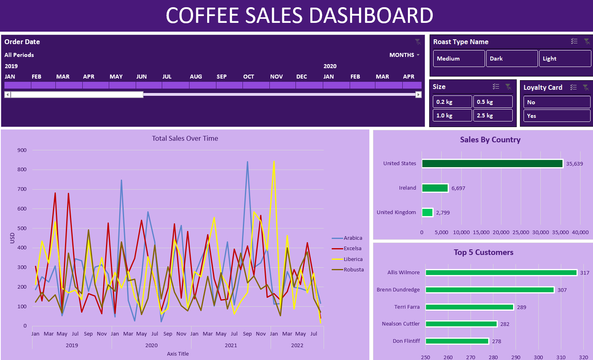

# coffee_sales_dashboard
Interactive Excel Dashboard for Coffee Sales Analysis | Powered by Pivot Tables, XLOOKUP, and Data Visualization

## 🚀 Project Goal

To analyze coffee sales performance and help marketing, sales, and operations teams make data-driven decisions to increase revenue.

 ## 💡 Business Insights from the Dashboard

Here’s how this dashboard helps in decision-making across departments:

### 1. Identify Best-Selling Products and Promote Them
- Arabica Medium Roast (1kg) is the top seller
- Feature it in marketing campaigns
- Offer bundle discounts or “Buy 2 Get 1” deals to boost volume

### 2. Spot Underperforming Products and Fix the Gaps
- Re-evaluate pricing, packaging, or promotion
- Consider flash sales to clear inventory

### 3. Target High-Value Customers for Upselling
- Create personalized offers or loyalty rewards
- Encourage repeat purchases with tailored strategies

### 4. Regional Sales Focus
- Most sales are from the US → Focus marketing budget and stock allocation there
- Analyze low-performing countries for pricing, taste preferences, or campaign effectiveness

### 5. Seasonal Campaign Planning
- Jan–March shows a spike in sales
- Run holiday bundles and introduce limited-edition flavors
- Launch timely promotions aligned with demand

### 6. Loyalty Card Insights = Retention Strategy
- Loyalty members spend more
- Expand loyalty programs and offer exclusive perks

## ⚙️ Tools & Excel Functions Used

- **Pivot Tables** & **Slicers** for dynamic filtering
- **XLOOKUP** and **INDEX-MATCH** for automated data mapping
- **IF** statements for clean product labeling
- Charts to visualize trends and customer insights

## 📸 Dashboard Preview

